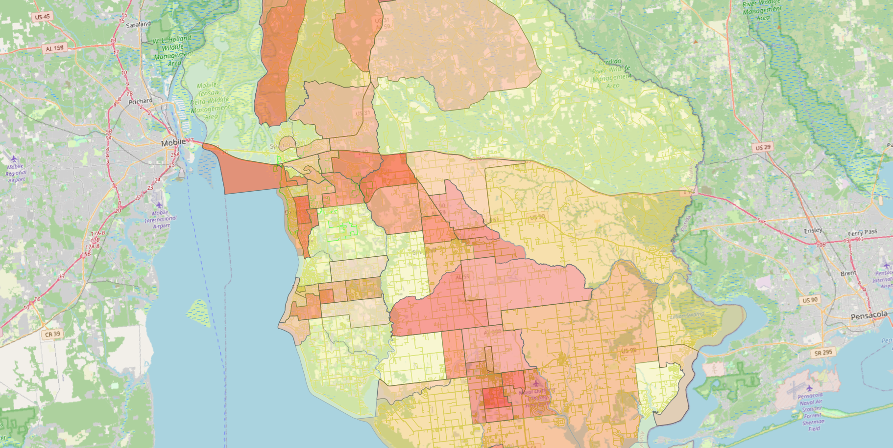
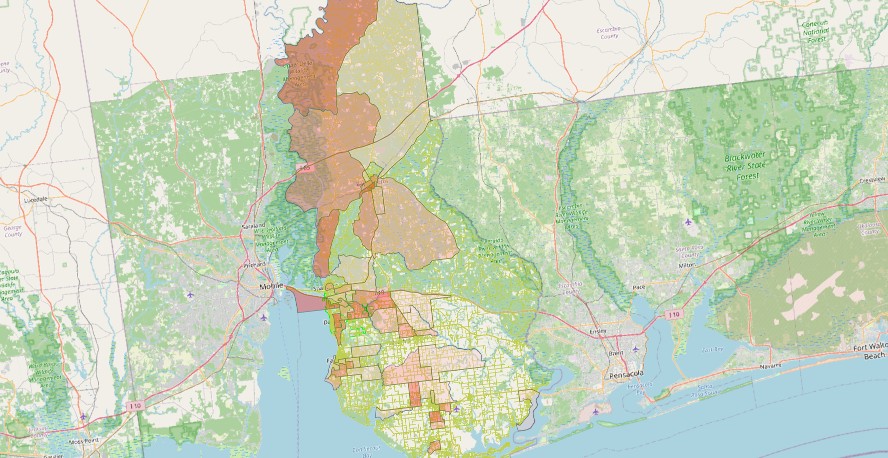

# Baldwin County Civic GIS — Development Pressure & Social Vulnerability

A spatial analysis of how development pressure and social vulnerability overlap in
Baldwin County, Alabama. Built from open federal data using QGIS, with every layer
sourced and every step documented.

> **Status:** In progress · **Author:** Jacob Harvison · **Focus:** civic & environmental spatial analysis

## Overview

This project asks a simple question with real local stakes: **where does new
development pressure land relative to the communities least equipped to absorb its
impacts?**

To examine it spatially, I integrated two independent public datasets — the CDC/ATSDR
Social Vulnerability Index and U.S. Census demographic data — joined to census
geographies so the layers can be compared on common ground. A proposed ~134-acre
planned-unit development footprint in the Daphne area was digitized and added as a
case study in siting.

## Study Area

Baldwin County, Alabama, with a focus on the Daphne / Eastern Shore corridor.

## Data Sources

| Layer | Source | Vintage |
|-------|--------|---------|
| Social Vulnerability Index (tracts) | CDC/ATSDR SVI | 2022 |
| Demographic composition (block groups) | U.S. Census ACS, table B02001 | 2022 |
| Census geographies | U.S. Census TIGER/Line | 2022–2024 |
| Roads & base data | U.S. Census TIGER / OpenStreetMap | 2024 |
| Development footprint | Manually digitized from public planning records | — |

## Methods

Layers were acquired from their authoritative sources, standardized, and joined on
GEOID in QGIS. Demographic percentage fields were derived from ACS counts, and both
the SVI and demographic layers were styled as graduated choropleths. The development
footprint was digitized over imagery from public planning documents. Join
completeness was checked against published tract and block-group counts.

## Key Outputs

*Overall social vulnerability (CDC/ATSDR SVI 2022, RPL_THEMES) by census tract —
darker red = higher vulnerability. Vulnerability concentrates in north Baldwin
County, while most of the Eastern Shore ranks low.*

*Percent Black population (ACS B02001) by census block group.*

## Findings

- Baldwin County skews low-vulnerability overall: of 43 census tracts, 19 rank below
  the 0.25 SVI percentile and only 2 exceed 0.75 (county mean: 0.35). Vulnerability
  is concentrated, not widespread — which makes its locations matter.
- Census Tract 106 (Bay Minette area, north Baldwin) is an extreme outlier: the
  96th percentile for social vulnerability statewide, with a population 56% Black
  and 59% below 150% of the poverty line. Vulnerability and Black population overlap
  sharply where they occur.
- That overlap holds county-wide at the tract level: tracts above the 0.5 SVI
  percentile average 12.9% Black population versus 5.7% for tracts below it
  (Pearson r ≈ 0.47).
- On the Eastern Shore, the Daphne-area corridor tract (Tract 108, SVI 0.53) is the
  most vulnerable in its vicinity — surrounding tracts range 0.16–0.34 — meaning
  the studied development footprint sits beside the shore's main pocket of relative
  vulnerability rather than its affluent core.

**Limitations.** SVI statistics are tract-level and the demographic map is
block-group-level; patterns at one scale don't automatically hold at the other.
ACS values are survey estimates with margins of error. Correlation between
vulnerability and demographics describes spatial overlap, not causation. The
digitized footprint carries ordinary digitization uncertainty.

## Tech Stack

**GIS:** QGIS · graduated choropleth symbology · georeferencing & digitizing
**Data:** CDC/ATSDR SVI · U.S. Census ACS · TIGER/Line · OpenStreetMap

## Contact

Jacob Harvison · Jacobharvison327@gmail.com · github.com/jacobharvison

[MIT] — see LICENSE. Data remain subject to their original providers' terms.

Contact

Jacob Harvison · Jacobharvison327@gmail.com · github.com/jacobharvison
